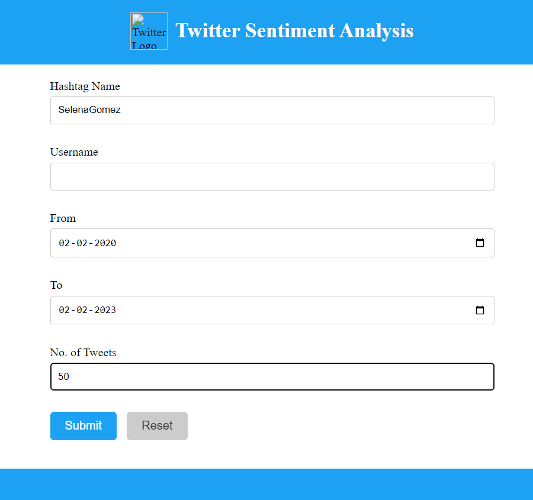

<h3 align="center">Twitter Sentiment Analysis using Vader.</h3> 

    Twitter hashtag analyser using Vader
     
     
    ·
    <a href="https://github.com/abhiramgorle/Twitter_Sentiment_Analysis/issues">Report Bug</a>
    ·
    <a href="https://github.com/abhiramgorle/Twitter_Sentiment_Analysis/issues">Request Feature</a>
  

 
## About The Project

This project's main idea is to develop an easily accessible solution for Analysing the twitter hashtags and portraying the result in a user-friendly manner.

## Main Page :

## Reslut page :

### Built With

The complete system is built with usinf python language.
<!-- MARKDOWN LINKS & IMAGES -->
<!-- https://www.markdownguide.org/basic-syntax/#reference-style-links -->
[React.js]: https://img.shields.io/badge/Python-3776AB?style=for-the-badge&logo=python&logoColor=white
[React-url]: https://www.python.org/
* [![React][React.js]][React-url]

